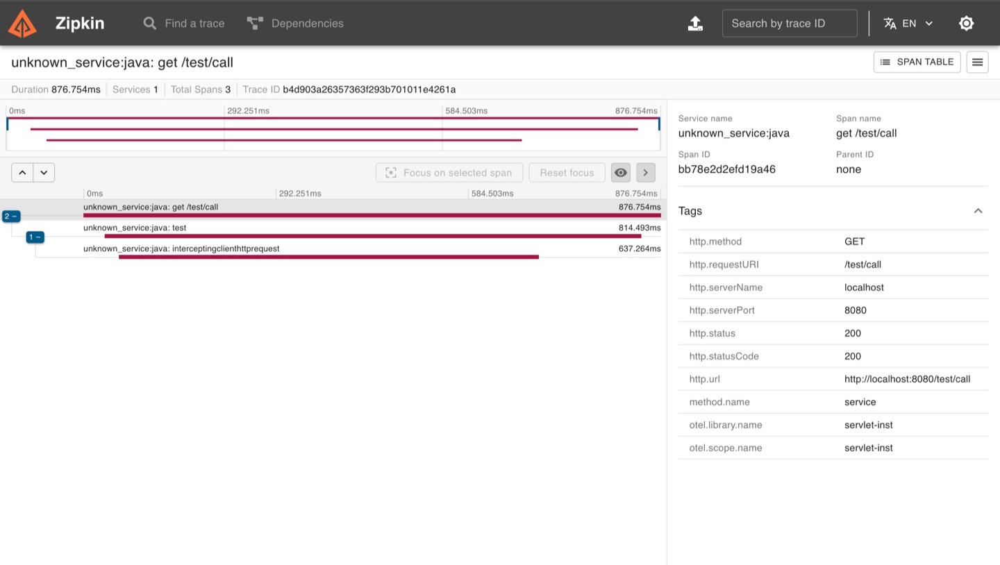
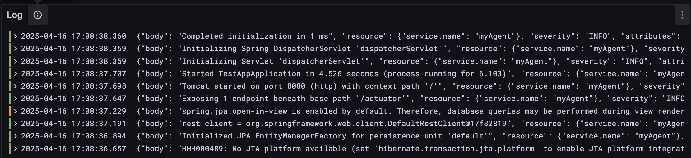

<!-- ALL-CONTRIBUTORS-BADGE:START - Do not remove or modify this section -->
[](#contributors-)
<!-- ALL-CONTRIBUTORS-BADGE:END -->

## Latest Release 🚀

The release version is v1.1.0. 

- 2025/04/25 - 1.1.0 version
- 2024/12/30 - 1.0.0 version

## Note

About traffic-hunter v1.1.0

- Not supported distributed trace
- We were unable to integrate observability due to the absence of Traffic Hunter Visualization. We will complete and provide the visualization shortly.
- For the time being, **Zipkin** should be used in an in-memory environment. If a **Zipkin** environment is already set up, feel free to use it. Otherwise, use the **in-memory** setup for simple performance testing. We will improve the convenience in the next version—stay tuned!

## Intro. Traffic-Hunter

**Traffic-Hunter** is APM (Application Performance Management) 


- `Real-Time Monitoring`: Capture and visualize application metrics and transaction logs in real-time.


- `Easy Configuration`: Easily configure the agent using a simple YAML file, making setup straightforward and user-friendly.


- `Efficient Data Storage`: Leverages [**TimescaleDB**](https://www.timescale.com/) for efficient storage and querying of time-series data, 
   enabling high-performance analytics on metrics and traces.


- `Visualization`: This APM leverages [**Grafana**](https://grafana.com/docs/grafana/latest/) for powerful and customizable visualization of metrics and transaction logs, enabling real-time insights and easy integration into your observability stack.


- `Zero-Code`: Traffic Hunter Agent uses **Java Instrumentation** to modify bytecode at runtime, requiring no code changes from users. Simply attach the agent, and it automatically tracks metrics and traces with zero configuration.

## Getting Started

- [**Quick-start**](https://traffic-hunter.gitbook.io/traffic-hunter) - Quick-start and installation guide.

## Overview 👀

Traffic-Hunter provides full observability support. While you currently need to build your traces using Zipkin, 
we’ll soon introduce [**traffic‑hunter‑visualization**](https://github.com/traffic-hunter/traffic-hunter-visualization) to eliminate that inconvenience.

- **Application Metric** - cpu, heap memory, thread, web server, dbcp (database connection pool)


- **Trace** - Trace track application requests in real-time, recording executed methods and related information. (Support zipkin)



- **Logs** - Logs from multiple applications can be centrally managed to enable efficient logging.



## Version Compatibility 👏

| Java Version | Agent            | Server         | Notes |
|--------------|------------------|----------------|-------|
| 21+          | ✅ Supported      | ✅ Supported    |       |


### Notes
- Java versions below 21 are **not supported**.
- For optimal performance and access to the latest features, use Java 21.
- Ensure both the agent and the server are running compatible Java versions.

## Supported Instrumentation Plugin

| Instrumentation Plugin | Version  | Note                                                 |
|------------------------|----------|------------------------------------------------------|
| Servlet                | 6.0.0+   | Jakarta servlet                                      |
| Spring web-mvc         | 6.2.0+   |                                                      |
| Spring boot            | 3.2.0+   | Supported RestClient,<br/>Not Supported RestTemplate |
| JDBC                   | Java 21+ |                                                      |
| HttpClient             | Java 21+ |                                                      |
| HttpUrlConnection      | Java 21+ |                                                      |
| Hibernate              | 6.0.0+   | LinkageError Issue, <br/>Not Support                 |
| Logger                 | Java 21+ | java.util.Logging                                    |
| LogBack                | 1.5.0+   | ch.qos.logback                                       |

## License

```text
The MIT License

Copyright (c) 2024 traffic-hunter.org

Permission is hereby granted, free of charge, to any person obtaining a copy
of this software and associated documentation files (the "Software"), to deal
in the Software without restriction, including without limitation the rights
to use, copy, modify, merge, publish, distribute, sublicense, and/or sell
copies of the Software, and to permit persons to whom the Software is
furnished to do so, subject to the following conditions:

The above copyright notice and this permission notice shall be included in
all copies or substantial portions of the Software.

THE SOFTWARE IS PROVIDED "AS IS", WITHOUT WARRANTY OF ANY KIND, EXPRESS OR
IMPLIED, INCLUDING BUT NOT LIMITED TO THE WARRANTIES OF MERCHANTABILITY,
FITNESS FOR A PARTICULAR PURPOSE AND NONINFRINGEMENT. IN NO EVENT SHALL THE
AUTHORS OR COPYRIGHT HOLDERS BE LIABLE FOR ANY CLAIM, DAMAGES OR OTHER
LIABILITY, WHETHER IN AN ACTION OF CONTRACT, TORT OR OTHERWISE, ARISING FROM,
OUT OF OR IN CONNECTION WITH THE SOFTWARE OR THE USE OR OTHER DEALINGS IN
THE SOFTWARE.
```


## Contributors ✨

Thanks goes to these wonderful people ([emoji key](https://allcontributors.org/docs/en/emoji-key)):

<!-- ALL-CONTRIBUTORS-LIST:START - Do not remove or modify this section -->
<!-- prettier-ignore-start -->
<!-- markdownlint-disable -->
<table>
  <tbody>
    <tr>
      <td align="center" valign="top" width="14.28%"><a href="https://github.com/yungwangoh"><br /><sub><b>yungwangoh</b></sub></a><br /><a href="https://github.com/traffic-hunter/traffic_hunter/commits?author=yungwangoh" title="Code">💻</a> <a href="#infra-yungwangoh" title="Infrastructure (Hosting, Build-Tools, etc)">🚇</a> <a href="https://github.com/traffic-hunter/traffic_hunter/commits?author=yungwangoh" title="Documentation">📖</a></td>
      <td align="center" valign="top" width="14.28%"><a href="https://github.com/JuSeong1130"><br /><sub><b>JuSeong1130</b></sub></a><br /><a href="https://github.com/traffic-hunter/traffic_hunter/commits?author=JuSeong1130" title="Code">💻</a></td>
    </tr>
  </tbody>
</table>

<!-- markdownlint-restore -->
<!-- prettier-ignore-end -->

<!-- ALL-CONTRIBUTORS-LIST:END -->

This project follows the [all-contributors](https://github.com/all-contributors/all-contributors) specification. Contributions of any kind welcome!